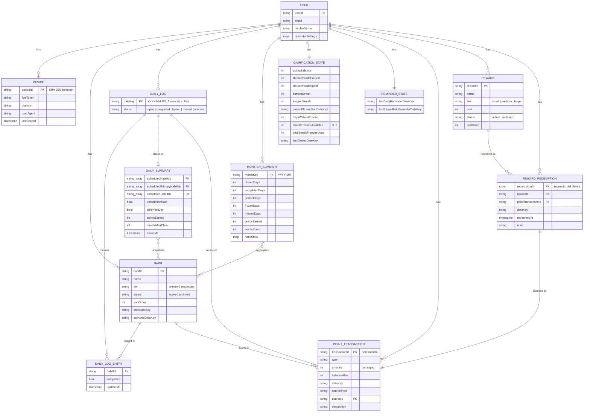

# Modelo de datos — Firestore

Estado: **aprobado**, con decisiones de negocio confirmadas (sección 11). Plan de implementación en [plan/README.md](plan/README.md).

## 1. Vista general

Todo cuelga de `users/{userId}`. Cada funcionalidad es una subcolección independiente.

```
users/{userId}                             UserProfile         escribe: cliente
├── devices/{deviceId}                     Device              escribe: cliente
├── habits/{habitId}                       Habit               escribe: cliente
├── dailyLogs/{dateKey}                    DailyLog            escribe: cliente (entries de hoy) + servidor (cierre)
├── monthlySummaries/{monthKey}            MonthlySummary      escribe: solo servidor
├── serverState/gamification               GamificationState   escribe: solo servidor
├── serverState/reminders                  ReminderState       escribe: solo servidor
├── pointTransactions/{transactionId}      PointTransaction    escribe: solo servidor
├── rewards/{rewardId}                     Reward              escribe: cliente
└── rewardRedemptions/{redemptionId}       RewardRedemption    escribe: solo servidor

Futuro (sin tocar lo anterior):
├── tasks/{taskId}                         task tracker
├── goals/{goalId}, journalEntries/{...}   crecimiento personal
└── dailyLogs/{dateKey}.checkIn            ánimo / energía / foco / motivación
```

"Servidor" = Cloud Functions (Admin SDK), que ignoran las reglas de seguridad. Todo documento que solo escribe el servidor vive en una colección que las reglas bloquean por completo para escritura del cliente. `serverState` agrupa los documentos únicos de ese tipo; si en el futuro aparece otro estado interno, va ahí.

## 2. Tipos y constantes compartidos

```ts
/** Día de calendario en America/La_Paz, formato 'YYYY-MM-DD'. Ordenable como string. */
type DateKey = string;

/** Mes de calendario en America/La_Paz, formato 'YYYY-MM'. */
type MonthKey = string;

type HabitTier = 'primary' | 'secondary';
type RewardTier = 'small' | 'medium' | 'large';
type EntityStatus = 'active' | 'archived';

/**
 * open:      día en curso, todavía no cerrado.
 * completed: se cumplió la meta de racha (todos los principales). La racha suma.
 * frozen:    no se cumplió, pero un protector salvó la racha. La racha se mantiene sin sumar.
 * missed:    no se cumplió y no había protector (o no había racha que proteger). La racha vuelve a 0.
 * inactive:  no había ningún hábito programado ese día. No afecta la racha ni da puntos.
 */
type DayStatus = 'open' | 'completed' | 'frozen' | 'missed' | 'inactive';

type PointTransactionType =
  | 'habit_completion'
  | 'perfect_day_bonus'
  | 'streak_bonus_7_days'
  | 'streak_bonus_30_days'
  | 'streak_freeze_purchase'
  | 'reward_redemption'
  | 'manual_adjustment';
  // futuro: 'task_completion', ...
```

Constantes de negocio, en un único módulo compartido por frontend y functions:

```ts
const APP_TIME_ZONE = 'America/La_Paz';
const HABIT_POINTS: Record<HabitTier, number> = { primary: 10, secondary: 5 };
const MAX_PRIMARY_HABITS = 3;
const PERFECT_DAY_BONUS = 5;
const STREAK_BONUSES = [
  { everyDays: 7, points: 20, type: 'streak_bonus_7_days' },
  { everyDays: 30, points: 100, type: 'streak_bonus_30_days' },
] as const;
const STREAK_FREEZE_COST = 150;
const MAX_STREAK_FREEZES = 2;
// Solo sugerencia para la UI; no se valida en servidor (ver sección 11).
const REWARD_TIER_COST_RANGES: Record<RewardTier, { min: number; max: number }> = {
  small: { min: 50, max: 80 },
  medium: { min: 150, max: 250 },
  large: { min: 500, max: 700 },
};
```

Todo documento lleva `createdAt: Timestamp`, `updatedAt: Timestamp` y `schemaVersion: number`; no se repiten abajo.

## 3. Colecciones

### `users/{userId}` — UserProfile
`userId` = `uid` de Firebase Auth. Lo crea la función `onUserCreated` (sección 7).

```ts
interface UserProfile {
  email: string;
  displayName: string;
  reminderSettings: {
    enabled: boolean;
    dailyReminderTime: string;         // 'HH:mm' hora Bolivia; recordatorio general del día
    streakRiskReminderTime: string;    // 'HH:mm'; solo se envía si la meta de hoy no está cumplida
  };
}
```

La zona horaria no se guarda aquí: es la constante `APP_TIME_ZONE`. Un campo que el sistema ignora sería una trampa.

### `users/{userId}/devices/{deviceId}` — Device
Registro de los dispositivos que reciben notificaciones push (sección 8). `deviceId` = hash SHA-256 del token, para no duplicarlo.

```ts
interface Device {
  fcmToken: string;
  platform: 'android' | 'desktop' | 'other';
  userAgent: string;                   // para identificar el dispositivo en ajustes
  lastSeenAt: Timestamp;               // se actualiza al abrir la app; permite limpiar tokens viejos
}
```

### `users/{userId}/habits/{habitId}` — Habit

```ts
interface Habit {
  name: string;
  description: string | null;
  icon: string;
  color: string;                       // hex, ej. '#8B5CF6'
  tier: HabitTier;                     // máximo MAX_PRIMARY_HABITS activos como 'primary'
  schedule: { type: 'daily' };         // extensible: { type: 'weekly'; daysOfWeek: number[] }
  status: EntityStatus;
  sortOrder: number;
  startDateKey: DateKey;               // primer día en que cuenta
  archivedDateKey: DateKey | null;     // último día en que cuenta (inclusive)
}
```

- **Cuándo cuenta un hábito:** en el día `D` si `startDateKey <= D` y (`archivedDateKey` es `null` o `D <= archivedDateKey`). Archivar un hábito hoy **no lo saca del día de hoy**: así no se puede esquivar una racha rota archivando a las 23:59.
- **Valor en puntos:** sale de `tier` vía `HABIT_POINTS`; no se guarda en el hábito. El monto acreditado queda fijo en cada `PointTransaction`, así que cambiar las reglas o el tier nunca reescribe el historial.
- **Nunca se borra**, solo se archiva. Así se conservan las estadísticas y las referencias.
- **Máximo 3 principales:** se valida en la UI con la constante compartida. No se valida en el servidor (ver deudas aceptadas, sección 10).

### `users/{userId}/dailyLogs/{dateKey}` — DailyLog
Un documento por día. El ID es la fecha (`'2026-09-21'`).

```ts
interface DailyLog {
  dateKey: DateKey;                    // repetido del ID para poder consultar por rango

  // Escribe el cliente, solo si dateKey es el día de hoy en Bolivia
  entries: Record<string /* habitId */, {
    completed: boolean;
    updatedAt: Timestamp;
  }>;

  // Escribe el servidor al cerrar el día
  status: DayStatus;                   // el cliente solo puede crear el doc con 'open'
  summary: DailySummary | null;        // null mientras el día está abierto
}

interface DailySummary {
  scheduledHabitIds: string[];         // foto de los hábitos que contaron ese día
  scheduledPrimaryHabitIds: string[];  // subconjunto que define la meta de racha
  completedHabitIds: string[];         // cumplidos y además programados (ignora IDs inválidos)
  completionRate: number;              // 0..1 sobre scheduledHabitIds
  isPerfectDay: boolean;               // 100% de scheduledHabitIds cumplidos
  pointsEarned: number;                // suma de los movimientos positivos de ese día
  streakAfterClose: number;            // racha resultante; alimenta la gráfica de racha
  closedAt: Timestamp;
}
```

**Por qué un documento por día y no uno por hábito y día:**
- La grilla del mes son ~31 lecturas de documentos pequeños.
- El día es la unidad de todas las reglas (meta, día perfecto, racha, cierre): un solo documento se evalúa y se cierra de forma atómica.
- El ID determinista hace que las escrituras sean idempotentes y que las consultas por rango sean triviales.
- `summary` congela la foto del día: si mañana se archiva, se agrega o cambia de tier un hábito, el historial no cambia.
- El cierre crea el documento **aunque no haya habido actividad**, para que las gráficas no tengan huecos.
- Separar `summary` en un objeto simplifica las reglas: el cliente nunca puede tocar esa clave.

### `users/{userId}/monthlySummaries/{monthKey}` — MonthlySummary
Agregado mensual que actualiza `closeDay` en la misma transacción en que cierra cada día. Sirve para que las vistas anuales no lean 365 documentos (sección 9).

```ts
interface MonthlySummary {
  monthKey: MonthKey;
  closedDays: number;
  completedDays: number;               // incluye los días perfectos
  perfectDays: number;
  frozenDays: number;
  missedDays: number;
  pointsEarned: number;
  pointsSpent: number;                 // también lo actualizan purchaseStreakFreeze y redeemReward
  habitStats: Record<string /* habitId */, {
    scheduledDays: number;
    completedDays: number;
  }>;
  // futuro: promedios del check-in (ánimo, energía, foco, motivación)
}
```

### `users/{userId}/serverState/gamification` — GamificationState
Documento único con el saldo y la racha. Solo lectura para el cliente. Lo crea `onUserCreated`.

```ts
interface GamificationState {
  pointsBalance: number;               // caché de la suma del ledger
  lifetimePointsEarned: number;
  lifetimePointsSpent: number;

  currentStreak: number;               // días cerrados consecutivos (no incluye hoy)
  longestStreak: number;
  currentStreakStartDateKey: DateKey | null;
  daysWithoutFreeze: number;           // base de los bonos 7/30; vuelve a 0 al usar protector o perder la racha
  streakFreezesAvailable: number;      // 0..MAX_STREAK_FREEZES
  totalStreakFreezesUsed: number;

  lastClosedDateKey: DateKey;          // último día procesado por closeDay; al crear la cuenta = ayer
}
```

### `users/{userId}/serverState/reminders` — ReminderState
Evita enviar el mismo recordatorio dos veces el mismo día (la función que envía corre varias veces al día).

```ts
interface ReminderState {
  lastDailyReminderDateKey: DateKey | null;
  lastStreakRiskReminderDateKey: DateKey | null;
}
```

### `users/{userId}/pointTransactions/{transactionId}` — PointTransaction
Ledger **append-only**: nunca se edita ni se borra; las correcciones se hacen con un `manual_adjustment`. Cada movimiento se escribe en la misma transacción que actualiza `pointsBalance`, así que el saldo y el ledger nunca se desincronizan.

```ts
interface PointTransaction {
  type: PointTransactionType;
  amount: number;                      // con signo: +10, -150, ...
  balanceAfter: number;
  dateKey: DateKey;                    // día Bolivia al que pertenece el movimiento
  sourceType: 'habit' | 'daily_log' | 'streak_freeze' | 'reward_redemption' | 'manual';
  sourceId: string | null;             // habitId, dateKey, redemptionId...
  description: string;                 // texto para el usuario, ej. 'Racha de 7 días'
}
```

Todos los `transactionId` son deterministas, así que reintentar una operación nunca acredita dos veces:

| Movimiento | `transactionId` |
|---|---|
| Hábito cumplido | `completion_{dateKey}_{habitId}` |
| Día perfecto | `perfect_{dateKey}` |
| Bono de racha | `streak7_{dateKey}` / `streak30_{dateKey}` |
| Compra de protector | `freeze_{requestId}` |
| Canje | `redemption_{requestId}` |

`requestId` es un UUID que genera el cliente por cada intento de compra o canje. Si el usuario toca dos veces o la red reintenta, el servidor detecta el ID repetido y no cobra dos veces.

### `users/{userId}/rewards/{rewardId}` — Reward

```ts
interface Reward {
  name: string;
  description: string | null;
  icon: string;
  tier: RewardTier;
  cost: number;                        // libre; la UI sugiere el rango de REWARD_TIER_COST_RANGES
  status: EntityStatus;
  sortOrder: number;
}
```

### `users/{userId}/rewardRedemptions/{redemptionId}` — RewardRedemption
`redemptionId` = `requestId` del cliente.

```ts
interface RewardRedemption {
  rewardId: string;
  rewardSnapshot: { name: string; tier: RewardTier; cost: number };  // foto al momento del canje
  pointTransactionId: string;
  dateKey: DateKey;
  redeemedAt: Timestamp;
  note: string | null;
}
```

## 4. Relaciones

| Desde | Campo | Hacia |
|---|---|---|
| DailyLog | claves de `entries`, `summary.*HabitIds` | Habit |
| MonthlySummary | claves de `habitStats` | Habit |
| PointTransaction | `sourceType` + `sourceId` | Habit / DailyLog / RewardRedemption |
| RewardRedemption | `rewardId` | Reward |
| RewardRedemption | `pointTransactionId` | PointTransaction |

Las referencias se guardan como IDs `string`, no como `DocumentReference`: son más simples de serializar, exportar a JSON/CSV y tipar. Todas son relativas al mismo `users/{userId}`.



Nota: `DAILY_LOG_ENTRY` y `DAILY_SUMMARY` no son colecciones: viven como los campos `entries` y `summary` dentro de `DAILY_LOG`. Se dibujan aparte solo para mostrar sus relaciones.

## 5. Zona horaria (Bolivia, UTC-4)

- Dos tipos de tiempo, nunca mezclados:
  - **Instantes** (`createdAt`, `redeemedAt`…) → `Timestamp` de Firestore (UTC).
  - **Días y meses de calendario** → `DateKey` / `MonthKey`, calculados en `APP_TIME_ZONE`.
- Un único helper compartido entre frontend y functions, por ejemplo `toDateKey(instant)`, que usa `Intl.DateTimeFormat('en-CA', { timeZone: APP_TIME_ZONE })`. Prohibido usar `new Date().getDate()` o `toISOString().slice(0, 10)` para obtener "hoy".
- Se usa el identificador IANA y no un offset fijo `-4`: es igual de correcto hoy y resiste cambios de política horaria.
- Las reglas de seguridad no tienen `Intl`: calculan el día de hoy restando 4 horas a `request.time` (Bolivia no tiene horario de verano). Es el único lugar donde se acepta el offset fijo, documentado en las propias reglas.
- Las funciones programadas se configuran con `timeZone: APP_TIME_ZONE`.
- Semanas: lunes a domingo, calculadas a partir de `DateKey`.
- La hora que manda es siempre la del **servidor** (`request.time`), nunca la del dispositivo: cambiar la hora del celular no permite marcar días pasados.

## 6. Ciclo de un día

1. **Durante el día (cliente):** el usuario marca hábitos → se escribe `dailyLogs/{hoy}.entries`. Funciona offline gracias a la caché de Firestore. La UI muestra los **puntos del día como provisionales** (calculados con `HABIT_POINTS`) y la racha como "`currentStreak` + 1 si la meta de hoy ya está cumplida", estilo Duolingo.
2. **A las 00:00 Bolivia:** las reglas dejan de aceptar escrituras sobre ese día (sin margen de gracia).
3. **A las 00:05 Bolivia (`closeDay`):** se cierra el día, se acreditan los puntos de verdad, se evalúa la racha y se actualizan los agregados.

**Por qué los puntos se acreditan al cierre y no al marcar cada hábito:**
- Marcar y desmarcar no genera movimientos en el ledger (sin reversos ni ruido).
- No hay carreras entre un trigger tardío y el cierre del día.
- Todos los puntos del día se calculan con la misma foto de hábitos y tiers, así que son siempre coherentes con el resumen.
- Se evita un trigger por cada toque: menos costo y menos piezas.
- Consecuencia: los puntos de hoy se pueden gastar desde mañana. Encaja con la idea de "me lo gané".

## 7. Cloud Functions

| Función | Tipo | Responsabilidad |
|---|---|---|
| `onUserCreated` | Trigger de Auth | Crea `users/{uid}`, `serverState/gamification` (con `lastClosedDateKey` = ayer) y `serverState/reminders`. |
| `closeDay` | Programada 00:05 `APP_TIME_ZONE` | Cierra cada día pendiente (ver abajo). |
| `purchaseStreakFreeze` | Callable | Transacción: saldo ≥ `STREAK_FREEZE_COST` y protectores < `MAX_STREAK_FREEZES` → movimiento, estado y `pointsSpent` del mes. |
| `redeemReward` | Callable | Transacción: recompensa activa y saldo ≥ costo → movimiento, canje con foto de la recompensa y `pointsSpent` del mes. |
| `sendReminders` | Programada cada 15 min | Envía push si coincide con la hora configurada y no se envió hoy (`serverState/reminders`). Borra de `devices` los tokens que FCM reporta como inválidos. |

**`closeDay`**: por cada día `D` desde `lastClosedDateKey + 1` hasta ayer, **una transacción por día**. Si la función falla o no corre un día, la siguiente ejecución se pone al día y ningún día se procesa dos veces, porque `lastClosedDateKey` avanza en la misma transacción. En cada transacción:

1. Determina los hábitos programados en `D` (regla de la sección 3, con el tier actual) y los cumplidos según `entries` (ignora IDs que no estén programados).
2. **Meta de racha** = todos los principales programados. Si no hay principales, la meta pasa a ser todos los programados. Si no hay ningún hábito programado → `inactive` y termina.
3. Resultado:
   - Meta cumplida → `completed`, `currentStreak++`, `daysWithoutFreeze++`. Bono de racha por cada regla de `STREAK_BONUSES` donde `daysWithoutFreeze` sea múltiplo de `everyDays` (el día 210 da ambos bonos). Si además `isPerfectDay`, suma `PERFECT_DAY_BONUS`.
   - Meta no cumplida, `currentStreak > 0` y hay protector → `frozen`, `streakFreezesAvailable--`, la racha se mantiene sin sumar, `daysWithoutFreeze = 0`.
   - Cualquier otro caso → `missed`, `currentStreak = 0`, `daysWithoutFreeze = 0`. **No se gasta un protector si no hay racha que proteger.**
4. Un `habit_completion` por cada hábito programado y cumplido, más los bonos, con ID determinista.
5. Escribe `status` y `summary`, actualiza `serverState/gamification` (saldo, racha, `longestStreak`, `lastClosedDateKey`) y suma en `monthlySummaries/{mes de D}`.

Requiere el plan **Blaze**, porque las funciones programadas y las callables no existen en el plan gratuito. Con un solo usuario el consumo queda dentro de la cuota gratuita (Cloud Scheduler incluye 3 jobs gratis y aquí se usan 2). Configurar una alerta de presupuesto.

## 8. Notificaciones push y `devices`

- Para mandar un push, el servidor necesita el **token FCM** de cada navegador o app instalada. Sin guardarlo no hay forma de enviar recordatorios.
- Cada instalación tiene su propio token (la PWA del celular y el navegador de la PC son dos tokens distintos) y los tokens cambian o expiran.
- Por eso es una subcolección y no un solo campo: permite varios dispositivos, actualizar el token cuando cambia, borrar los inválidos (`sendReminders`) y mostrar en ajustes qué dispositivos reciben avisos.
- El cliente registra o refresca su token al abrir la app, si el usuario dio permiso de notificaciones.

## 9. Estadísticas y rendimiento

Calcular en el cliente **no** hace lenta la app: el cuello de botella en apps así no es el cálculo, sino cuántos documentos se descargan. El diseño limita eso:

| Vista | Qué se lee | Documentos |
|---|---|---|
| Hoy / semana | `dailyLogs` del rango | 1–7 |
| Mes (grilla, % por día, % por hábito) | `dailyLogs` del mes | ≤ 31 |
| Año (tendencia, % por hábito) | `monthlySummaries` del año | ≤ 12 |
| Totales históricos (saldo, racha más larga) | `serverState/gamification` | 1 |

- El cálculo más pesado (un mes: ~31 días × ~10 hábitos ≈ 300 operaciones) le toma al celular menos de un milisegundo.
- Con la caché persistente de Firestore (`persistentLocalCache`), al volver a abrir la app los datos salen del dispositivo y solo se descarga lo que cambió.
- Sin `monthlySummaries`, la vista anual leería 365 documentos, y a los 3 años la vista "todo el historial", más de 1000. El agregado evita esa deuda desde el inicio.

## 10. Reglas de seguridad

- **Acceso:** todo bajo `users/{userId}` requiere `request.auth.uid == userId`.
- **Registro:** el requerimiento es un solo usuario, pero Firebase Auth permite por defecto que cualquiera se registre y use la app con sus propios datos. Tras crear la cuenta propia: desactivar el registro en la consola (*Authentication → Settings → User actions*) y, como segunda barrera, limitar las reglas a una lista de `uid` permitidos.
- **El cliente escribe:**
  - `users/{userId}` (solo `displayName` y `reminderSettings`).
  - `devices`, `habits`, `rewards`.
  - `dailyLogs/{dateKey}` solo si `dateKey` es **hoy** en Bolivia según `request.time`, solo las claves `dateKey`, `entries`, `status == 'open'` y metadatos, nunca `summary`.
- **El cliente solo lee:** `serverState`, `monthlySummaries`, `pointTransactions`, `rewardRedemptions`.
- **Validación de forma** (tipos, enums, longitudes) en las reglas y en los converters tipados (`withConverter`) del cliente.

**Deudas aceptadas** (conscientes, por ser una app de un solo usuario):
- **Máximo de 3 principales:** se valida solo en la UI. Las reglas no pueden contar documentos, y forzarlo en servidor requeriría pasar toda edición de hábitos por una callable. El único que podría saltárselo es el propio dueño.
- **Tier al cierre:** si se cambia el tier de un hábito durante el día, el cierre usa el tier nuevo.
- **Marcas offline tardías:** si se marca un hábito offline a las 23:58 y el celular sincroniza después de medianoche, las reglas rechazan la escritura (es la política sin gracia). La UI debe mostrar un indicador de "pendiente de sincronizar" para que no pase desapercibido.

## 11. Decisiones confirmadas

1. **Meta de racha:** todos los hábitos principales programados. Tres resultados: racha perdida (`missed`), racha activa (`completed`) y racha perfecta (`completed` + `isPerfectDay`, principales y secundarios al 100%). "Perfecta" no es un valor de `status`: solo suma el bono, no cambia el conteo.
2. **Bonos de 7/30 días:** recurrentes en cada múltiplo.
3. **Día protegido:** conserva la racha sin sumarla (`frozen`). El protector solo se usa si hay una racha activa.
4. **Sin margen de gracia:** solo se edita el día de hoy; a las 00:00 Bolivia el día se bloquea.
5. **Costos de recompensas:** los rangos son una sugerencia. Pendiente calibrar con datos reales de puntos ganados por semana antes de cerrar el MVP, para mantener el equilibrio.

## 12. Extensibilidad

- Una funcionalidad nueva = una subcolección nueva + nuevos valores en los enums (`PointTransactionType`, `sourceType`). Nada existente cambia de forma.
- `schemaVersion` en cada documento permite migraciones graduales.
- El task tracker (`tasks/{taskId}` con `dueDateKey`, `completedAt`, `points`) reutiliza `DateKey`, el ledger y `closeDay` para acreditar puntos.
- El check-in de ánimo va dentro de `DailyLog` (misma granularidad diaria) y sus promedios, en `MonthlySummary`.
