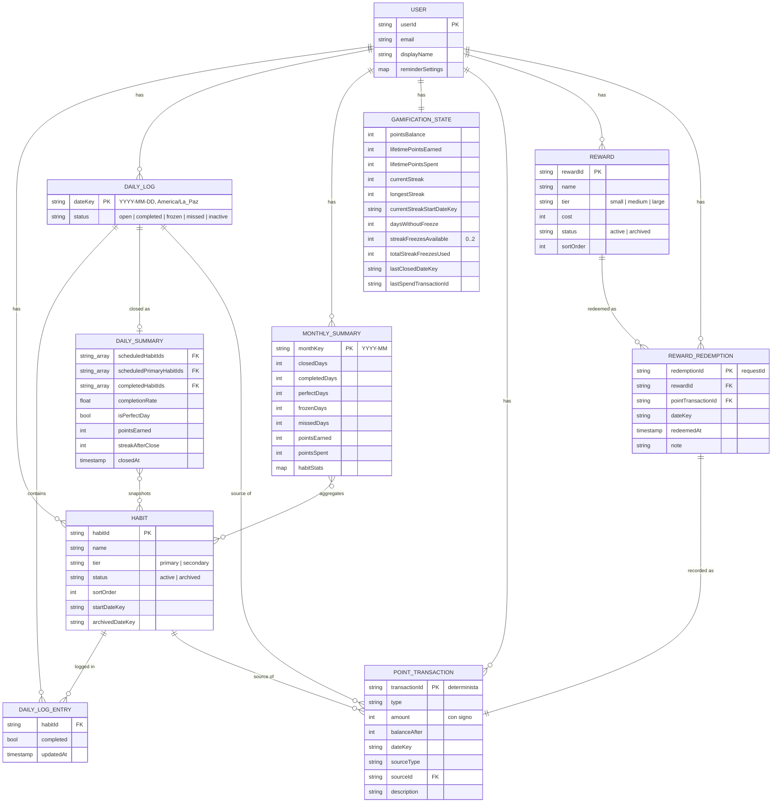

# Modelo de datos — Firestore

Estado: **aprobado**. Decisiones de negocio en la sección 11. Plan de implementación en [plan/README.md](plan/README.md).

**Arquitectura sin servidor propio:** Firebase en el plan gratuito **Spark** (sin tarjeta, sin Cloud Functions). La app (Expo: Android + web) hace todas las operaciones y las **reglas de seguridad de Firestore** validan que sean correctas. No hay backend, scripts programados ni claves de servicio.

## 1. Vista general

Todo cuelga de `users/{userId}`. Cada funcionalidad es una subcolección independiente.

```
users/{userId}                             UserProfile         libre (campos permitidos)
├── habits/{habitId}                       Habit               libre (forma validada)
├── dailyLogs/{dateKey}                    DailyLog            entries: solo hoy · summary: solo al cerrar
├── monthlySummaries/{monthKey}            MonthlySummary      solo al cerrar, compra o canje
├── meta/gamification                      GamificationState   solo al cerrar, compra o canje
├── pointTransactions/{transactionId}      PointTransaction    solo crear; nunca editar ni borrar
├── rewards/{rewardId}                     Reward              libre (forma validada)
└── rewardRedemptions/{redemptionId}       RewardRedemption    solo crear, junto con su cobro

Futuro (sin tocar lo anterior):
├── tasks/{taskId}                         task tracker
├── goals/{goalId}, journalEntries/{...}   crecimiento personal
└── dailyLogs/{dateKey}.checkIn            ánimo / energía / foco / motivación
```

La columna derecha resume qué permiten las reglas de seguridad (sección 10). Las escrituras "sensibles" (saldo, racha, ledger) solo se aceptan dentro de las tres operaciones de la sección 7, y las reglas comprueban que cuadren.

## 2. Tipos y constantes compartidos

```ts
/** Día de calendario en America/La_Paz, formato 'YYYY-MM-DD'. Ordenable como string. */
type DateKey = string;

/** Mes de calendario en America/La_Paz, formato 'YYYY-MM'. */
type MonthKey = string;

type HabitTier = 'primary' | 'secondary';
type RewardTier = 'small' | 'medium' | 'large';
type EntityStatus = 'active' | 'archived';

/**
 * open:      día en curso, todavía no cerrado.
 * completed: se cumplió la meta de racha (todos los principales). La racha suma.
 * frozen:    no se cumplió, pero un protector salvó la racha. La racha se mantiene sin sumar.
 * missed:    no se cumplió y no había protector (o no había racha que proteger). La racha vuelve a 0.
 * inactive:  no había ningún hábito programado ese día. No afecta la racha ni da puntos.
 */
type DayStatus = 'open' | 'completed' | 'frozen' | 'missed' | 'inactive';

type PointTransactionType =
  | 'habit_completion'
  | 'perfect_day_bonus'
  | 'streak_bonus_7_days'
  | 'streak_bonus_30_days'
  | 'streak_freeze_purchase'
  | 'reward_redemption'
  | 'manual_adjustment';
  // futuro: 'task_completion', ...
```

Constantes de negocio en un único módulo (`packages/shared`). Las reglas de seguridad repiten los valores de puntos para validarlos; un test comprueba que ambos coincidan.

```ts
const APP_TIME_ZONE = 'America/La_Paz';
const HABIT_POINTS: Record<HabitTier, number> = { primary: 10, secondary: 5 };
const MAX_PRIMARY_HABITS = 3;
const PERFECT_DAY_BONUS = 5;
const STREAK_BONUSES = [
  { everyDays: 7, points: 20, type: 'streak_bonus_7_days' },
  { everyDays: 30, points: 100, type: 'streak_bonus_30_days' },
] as const;
const STREAK_FREEZE_COST = 150;
const MAX_STREAK_FREEZES = 2;
// Solo sugerencia para la UI; no se valida (ver sección 11).
const REWARD_TIER_COST_RANGES: Record<RewardTier, { min: number; max: number }> = {
  small: { min: 50, max: 80 },
  medium: { min: 150, max: 250 },
  large: { min: 500, max: 700 },
};
```

Todo documento lleva `createdAt: Timestamp`, `updatedAt: Timestamp` y `schemaVersion: number`; no se repiten abajo.

## 3. Colecciones

### `users/{userId}` — UserProfile
`userId` = `uid` de Firebase Auth. Lo crea la app en el primer inicio de sesión (sección 7).

```ts
interface UserProfile {
  email: string;
  displayName: string;
  reminderSettings: {
    enabled: boolean;
    dailyReminderTime: string;         // 'HH:mm' hora Bolivia; recordatorio general del día
    streakRiskReminderTime: string;    // 'HH:mm'; se cancela si la meta de hoy ya está cumplida
  };
}
```

Los horarios viven en el perfil para que se puedan editar desde cualquier dispositivo; el celular los lee y programa las notificaciones localmente (sección 8).

### `users/{userId}/habits/{habitId}` — Habit

```ts
interface Habit {
  name: string;
  description: string | null;
  icon: string;
  color: string;                       // hex, ej. '#8B5CF6'
  tier: HabitTier;                     // máximo MAX_PRIMARY_HABITS activos como 'primary'
  schedule: { type: 'daily' };         // extensible: { type: 'weekly'; daysOfWeek: number[] }
  status: EntityStatus;
  sortOrder: number;
  startDateKey: DateKey;               // primer día en que cuenta
  archivedDateKey: DateKey | null;     // último día en que cuenta (inclusive)
}
```

- **Cuándo cuenta un hábito:** en el día `D` si `startDateKey <= D` y (`archivedDateKey` es `null` o `D <= archivedDateKey`). Archivar un hábito hoy **no lo saca del día de hoy**: así no se puede esquivar una racha rota archivando a las 23:59.
- **Valor en puntos:** sale de `tier` vía `HABIT_POINTS`; no se guarda en el hábito. El monto acreditado queda fijo en cada `PointTransaction`, así que cambiar las reglas o el tier nunca reescribe el historial.
- **Nunca se borra**, solo se archiva. **Un hábito archivado no se reactiva** (se crea uno nuevo) y un hábito nuevo empieza hoy o después: ambas cosas cambiarían el resultado de días pasados todavía sin cerrar.
- **Máximo 3 principales:** se valida en la UI (sección 10, deudas aceptadas).

### `users/{userId}/dailyLogs/{dateKey}` — DailyLog
Un documento por día. El ID es la fecha (`'2026-09-21'`).

```ts
interface DailyLog {
  dateKey: DateKey;                    // repetido del ID para poder consultar por rango

  // Se escribe solo mientras dateKey es hoy en Bolivia
  entries: Record<string /* habitId */, {
    completed: boolean;
    updatedAt: Timestamp;
  }>;

  // Se escribe solo al cerrar el día
  status: DayStatus;                   // al crear el documento: 'open'
  summary: DailySummary | null;        // null mientras el día está abierto
}

interface DailySummary {
  scheduledHabitIds: string[];         // foto de los hábitos que contaron ese día
  scheduledPrimaryHabitIds: string[];  // subconjunto que define la meta de racha
  completedHabitIds: string[];         // cumplidos y además programados (ignora IDs inválidos)
  completionRate: number;              // 0..1 sobre scheduledHabitIds
  isPerfectDay: boolean;               // 100% de scheduledHabitIds cumplidos
  pointsEarned: number;                // suma de los movimientos de ese día
  streakAfterClose: number;            // racha resultante; alimenta la gráfica de racha
  closedAt: Timestamp;
}
```

**Por qué un documento por día y no uno por hábito y día:**
- La grilla del mes son ~31 lecturas de documentos pequeños.
- El día es la unidad de todas las reglas (meta, día perfecto, racha, cierre): un solo documento se evalúa y se cierra de forma atómica.
- El ID determinista hace que las escrituras sean idempotentes y que las consultas por rango sean triviales.
- `summary` congela la foto del día: si mañana se archiva, se agrega o cambia de tier un hábito, el historial no cambia.
- El cierre crea el documento **aunque no haya habido actividad**, para que las gráficas no tengan huecos.
- Separar `summary` en un objeto simplifica las reglas: `entries` y `summary` tienen permisos distintos.

### `users/{userId}/monthlySummaries/{monthKey}` — MonthlySummary
Agregado mensual que se actualiza en la misma transacción que cierra cada día. Sirve para que las vistas anuales no lean 365 documentos (sección 9).

```ts
interface MonthlySummary {
  monthKey: MonthKey;
  closedDays: number;
  completedDays: number;               // incluye los días perfectos
  perfectDays: number;
  frozenDays: number;
  missedDays: number;
  pointsEarned: number;
  pointsSpent: number;                 // también lo actualizan la compra de protector y el canje
  habitStats: Record<string /* habitId */, {
    scheduledDays: number;
    completedDays: number;
  }>;
  // futuro: promedios del check-in (ánimo, energía, foco, motivación)
}
```

### `users/{userId}/meta/gamification` — GamificationState
Documento único con el saldo y la racha. Lo crea la app en el primer inicio de sesión.

```ts
interface GamificationState {
  pointsBalance: number;               // caché de la suma del ledger; nunca negativo
  lifetimePointsEarned: number;
  lifetimePointsSpent: number;

  currentStreak: number;               // días cerrados consecutivos (no incluye hoy)
  longestStreak: number;
  currentStreakStartDateKey: DateKey | null;
  daysWithoutFreeze: number;           // base de los bonos 7/30; vuelve a 0 al usar protector o perder la racha
  streakFreezesAvailable: number;      // 0..MAX_STREAK_FREEZES
  totalStreakFreezesUsed: number;

  lastClosedDateKey: DateKey;          // último día cerrado; al crear la cuenta = ayer
  lastSpendTransactionId: string | null; // movimiento del último gasto (protector o canje)
}
```

`lastSpendTransactionId` existe para las reglas: cada compra o canje lo cambia al ID de su movimiento, y las reglas exigen que ese movimiento se cree en la misma transacción con el monto exacto. Así ningún descuento del saldo queda sin su registro en el historial.

### `users/{userId}/pointTransactions/{transactionId}` — PointTransaction
Ledger **append-only**: nunca se edita ni se borra (las reglas lo impiden); las correcciones se hacen con un `manual_adjustment` desde la consola de Firebase. Cada movimiento se escribe en la misma transacción que actualiza `pointsBalance`.

```ts
interface PointTransaction {
  type: PointTransactionType;
  amount: number;                      // con signo: +10, -150, ...
  balanceAfter: number;
  dateKey: DateKey;                    // día Bolivia al que pertenece el movimiento
  sourceType: 'habit' | 'daily_log' | 'streak_freeze' | 'reward_redemption' | 'manual';
  sourceId: string | null;             // habitId, dateKey, redemptionId...
  description: string;                 // texto para el usuario, ej. 'Racha de 7 días'
}
```

Todos los `transactionId` son deterministas. Crear dos veces el mismo ID es imposible (las reglas solo permiten crear), así que un reintento o un doble toque nunca cobra ni acredita dos veces:

| Movimiento | `transactionId` |
|---|---|
| Hábito cumplido | `completion_{dateKey}_{habitId}` |
| Día perfecto | `perfect_{dateKey}` |
| Bono de racha | `streak7_{dateKey}` / `streak30_{dateKey}` |
| Compra de protector | `freeze_{requestId}` |
| Canje | `redemption_{requestId}` |

`requestId` es un UUID que la app genera **una vez por intento** de compra o canje y reutiliza si reintenta.

### `users/{userId}/rewards/{rewardId}` — Reward

```ts
interface Reward {
  name: string;
  description: string | null;
  icon: string;
  tier: RewardTier;
  cost: number;                        // libre; la UI sugiere el rango de REWARD_TIER_COST_RANGES
  status: EntityStatus;
  sortOrder: number;
}
```

### `users/{userId}/rewardRedemptions/{redemptionId}` — RewardRedemption
`redemptionId` = `requestId`.

```ts
interface RewardRedemption {
  rewardId: string;
  rewardSnapshot: { name: string; tier: RewardTier; cost: number };  // foto al momento del canje
  pointTransactionId: string;
  dateKey: DateKey;
  redeemedAt: Timestamp;
  note: string | null;
}
```

## 4. Relaciones

| Desde | Campo | Hacia |
|---|---|---|
| DailyLog | claves de `entries`, `summary.*HabitIds` | Habit |
| MonthlySummary | claves de `habitStats` | Habit |
| PointTransaction | `sourceType` + `sourceId` | Habit / DailyLog / RewardRedemption |
| RewardRedemption | `rewardId` | Reward |
| RewardRedemption | `pointTransactionId` | PointTransaction |

Las referencias se guardan como IDs `string`, no como `DocumentReference`: son más simples de serializar, exportar a JSON/CSV y tipar. Todas son relativas al mismo `users/{userId}`.



Nota: `DAILY_LOG_ENTRY` y `DAILY_SUMMARY` no son colecciones: viven como los campos `entries` y `summary` dentro de `DAILY_LOG`. Se dibujan aparte solo para mostrar sus relaciones.

## 5. Zona horaria (Bolivia, UTC-4)

- Dos tipos de tiempo, nunca mezclados:
  - **Instantes** (`createdAt`, `redeemedAt`…) → `Timestamp` de Firestore (UTC).
  - **Días y meses de calendario** → `DateKey` / `MonthKey`, calculados en `APP_TIME_ZONE`.
- Un único helper en `packages/shared`, por ejemplo `toDateKey(instant)`, que usa `Intl.DateTimeFormat('en-CA', { timeZone: APP_TIME_ZONE })`. Prohibido usar `new Date().getDate()` o `toISOString().slice(0, 10)` para obtener "hoy".
- Se usa el identificador IANA y no un offset fijo `-4`: es igual de correcto hoy y resiste cambios de política horaria.
- Las reglas de seguridad no tienen `Intl`: calculan el día de hoy restando 4 horas a `request.time` (Bolivia no tiene horario de verano). Es el único lugar donde se acepta el offset fijo, documentado en las propias reglas.
- **La hora que manda es la del servidor** (`request.time` en las reglas), no la del dispositivo. Si el reloj del celular está mal, las escrituras sobre un día incorrecto se rechazan; la app muestra el error en vez de fallar en silencio.
- Semanas: lunes a domingo, calculadas a partir de `DateKey`.

## 6. Ciclo de un día

1. **Durante el día:** el usuario marca hábitos → se escribe `dailyLogs/{hoy}.entries`. La UI muestra al instante la racha, los puntos del día y la celebración de día perfecto, calculados con `evaluateDay` de `packages/shared`: los **mismos números** que dará el cierre. Si se desmarca algo, se recalculan solos.
2. **A las 00:00 Bolivia:** las reglas dejan de aceptar escrituras sobre ese día (sin margen de gracia).
3. **La próxima vez que se abre la app** (o al pasar la medianoche con la app abierta): la app **cierra los días pendientes** (sección 7). Los puntos pasan al saldo oficial y desde ese momento se pueden gastar.

**Por qué los puntos pasan al saldo al cierre y no al marcar cada hábito:**
- Marcar y desmarcar no genera movimientos en el ledger (sin reversos ni ruido).
- Todos los puntos del día se calculan con la misma foto de hábitos y tiers, siempre coherentes con el resumen.
- Consecuencia: los puntos de hoy se pueden gastar desde mañana. Encaja con la idea de "me lo gané".

## 7. Operaciones de la app

No hay servidor: estas operaciones las ejecuta la app como **transacciones de Firestore**, y las reglas (sección 10) validan cada escritura. La lógica de negocio vive en funciones puras de `packages/shared`; las operaciones solo leen, llaman a esa lógica y escriben.

| Operación | Cuándo | Qué hace |
|---|---|---|
| `initializeAccount` | Primer inicio de sesión (idempotente) | Crea `users/{uid}` y `meta/gamification` con valores iniciales (`lastClosedDateKey` = ayer, todo en 0). |
| `closePendingDays` | Al abrir la app, al volver a primer plano y al pasar la medianoche con la app abierta | Cierra cada día desde `lastClosedDateKey + 1` hasta ayer (ver abajo). |
| `purchaseStreakFreeze` | El usuario compra un protector | Transacción: saldo ≥ `STREAK_FREEZE_COST` y protectores < `MAX_STREAK_FREEZES` → movimiento, estado (con `lastSpendTransactionId`) y `pointsSpent` del mes de hoy. |
| `redeemReward` | El usuario canjea una recompensa | Transacción: recompensa activa y saldo ≥ costo → movimiento, canje con foto de la recompensa, estado (con `lastSpendTransactionId`) y `pointsSpent` del mes de hoy. |
| `scheduleReminders` | Solo Android: al abrir la app, al cambiar los horarios y al marcar hábitos | Reprograma las notificaciones locales (sección 8). |

**`closePendingDays`**: **una transacción por día**, en orden. Como `lastClosedDateKey` avanza en la misma transacción, ningún día se procesa dos veces, aunque la app esté abierta en el celular y en la PC al mismo tiempo: la segunda transacción ve el estado actualizado y no hace nada. Sin conexión no cierra; lo intenta la próxima vez. Por cada día `D`:

1. Lee los hábitos **antes** de la transacción (las transacciones del SDK cliente no admiten consultas). Dentro, lee `meta/gamification`, `dailyLogs/{D}` y `monthlySummaries/{mes de D}`, y confirma que `lastClosedDateKey + 1 == D`.
2. Llama a `evaluateDay`:
   - **Meta de racha** = todos los principales programados. Si no hay principales, la meta son todos los programados. Si no hay ningún hábito programado → `inactive`.
   - Meta cumplida → `completed`, `currentStreak++`, `daysWithoutFreeze++`. Un bono de racha por cada regla de `STREAK_BONUSES` donde `daysWithoutFreeze` sea múltiplo de `everyDays` (el día 210 da ambos). Si además `isPerfectDay`, suma `PERFECT_DAY_BONUS`.
   - Meta no cumplida, `currentStreak > 0` y hay protector → `frozen`, `streakFreezesAvailable--`, la racha se mantiene sin sumar, `daysWithoutFreeze = 0`.
   - Cualquier otro caso → `missed`, `currentStreak = 0`, `daysWithoutFreeze = 0`. **No se gasta un protector si no hay racha que proteger.**
3. Escribe `dailyLogs/{D}` (`status`, `summary`), un `habit_completion` por hábito programado y cumplido, los bonos, `meta/gamification` y `monthlySummaries`.

## 8. Notificaciones (solo Android)

- Son **notificaciones locales**: las programa la propia app en el celular, como una alarma (`expo-notifications`). No hay servidor ni push, funcionan sin internet y llegan a la hora exacta configurada.
- **Recordatorio diario:** se repite todos los días a `dailyReminderTime`.
- **Racha en riesgo:** se programa para `streakRiskReminderTime`. Al cumplirse la meta del día en el celular, se cancela la de hoy y queda programada la de mañana.
- Los horarios se editan en Ajustes desde cualquier dispositivo; el celular los aplica la próxima vez que se abre la app.
- **Cómo se programan:** `planReminders` (`packages/shared`) calcula los instantes exactos en hora de Bolivia para los próximos `REMINDER_PLAN_DAYS` días y la app los programa como avisos de fecha fija (no con el trigger diario del sistema, que usa la hora local del celular). Cada vez que se abre la app se reprograma la ventana completa.
- En la web no hay notificaciones (decisión del usuario).
- **Limitación conocida:** si la meta se cumple desde la PC y el celular no se abre antes de la hora del aviso, el aviso de racha en riesgo llega igual. Es aceptable porque completar el día desde la PC es poco frecuente.

## 9. Estadísticas y rendimiento

Calcular en el cliente **no** hace lenta la app: el cuello de botella no es el cálculo, sino cuántos documentos se descargan. El diseño limita eso:

| Vista | Qué se lee | Documentos |
|---|---|---|
| Hoy / semana | `dailyLogs` del rango | 1–7 |
| Mes (grilla, % por día, % por hábito) | `dailyLogs` del mes | ≤ 31 |
| Año (tendencia, % por hábito) | `monthlySummaries` del año | ≤ 12 |
| Totales históricos (saldo, racha más larga) | `meta/gamification` | 1 |

- El cálculo más pesado (un mes: ~31 días × ~10 hábitos ≈ 300 operaciones) toma menos de un milisegundo.
- **Web:** caché persistente de Firestore (`persistentLocalCache`); al volver a abrir, los datos salen del dispositivo.
- **Android:** el SDK JavaScript de Firebase solo tiene caché en memoria dentro de React Native. Las marcas hechas sin conexión se sincronizan al volver la red **mientras la app siga abierta**; si se cierra antes, se pierden. Es una limitación aceptada (sección 10).
- La cuota gratuita de Spark (50.000 lecturas y 20.000 escrituras diarias) queda muy por encima del uso de un solo usuario.

## 10. Reglas de seguridad

Sin servidor, las reglas son la única barrera: validan que cada operación de la sección 7 sea coherente, usando `getAfter()` para comparar el estado antes y después de la transacción.

- **Acceso:** todo bajo `users/{userId}` requiere `request.auth.uid == userId` y que el `uid` esté en la lista de permitidos.
- **Registro cerrado:** la cuenta del usuario se creó a mano en la consola y el registro está desactivado (*Authentication → Settings → User actions*). La app no tiene pantalla de registro. La lista de permitidos es la segunda barrera.
- **Clave de API restringida** (Google Cloud → Credenciales → "Browser key (auto created by Firebase)"): sin restricción de aplicación (Android con el SDK JS no envía los datos que esa restricción verifica) y **solo** Identity Toolkit API, Token Service API y Cloud Firestore API. La clave es pública por diseño; si se agrega otro servicio de Firebase, sumarlo a esa lista o fallará con un error 403.
- **Libre, con forma validada** (tipos, enums, longitudes): `users/{userId}` (solo `displayName` y `reminderSettings` después de crearlo), `habits`, `rewards`. Hábitos y recompensas no se pueden borrar.
- **`dailyLogs/{D}.entries`:** solo si `D` es hoy en Bolivia según `request.time`. Al crear el documento, `status == 'open'` y `summary == null`.
- **Cierre de un día** (`status`/`summary` de `dailyLogs/{D}`, movimientos de cierre, `meta/gamification`, `monthlySummaries`):
  - `D` es estrictamente anterior a hoy (según `request.time`).
  - `lastClosedDateKey` avanza **exactamente un día**, hasta `D`.
  - Los movimientos tienen el ID determinista del día y un monto válido para su tipo (10 o 5 por hábito, 5, 20, 100).
  - `pointsBalance >= 0` y `streakFreezesAvailable` entre 0 y 2, y no sube durante un cierre.
- **Compra de protector:** existe tras la transacción el movimiento `freeze_{requestId}` con −150; el saldo baja exactamente 150 y los protectores suben exactamente 1, sin pasar de 2.
- **Canje:** existe tras la transacción el movimiento `redemption_{requestId}` con −`cost` de la recompensa (leída con `get()`); el saldo baja exactamente ese costo y el canje referencia a ese movimiento.
- **`pointTransactions` y `rewardRedemptions`:** solo crear, nunca editar ni borrar.

**Deudas aceptadas** (conscientes, por ser una app de un solo usuario):
- **Las reglas validan la forma, no la matemática del cierre.** No pueden comprobar que la racha o los puntos calculados sean los correctos; eso lo garantizan los tests de `evaluateDay` (fase 02). El único que podría escribir datos incoherentes sería el propio dueño, a propósito.
- **Máximo de 3 principales:** se valida solo en la UI; las reglas no pueden contar documentos.
- **Tier al cierre:** si se cambia el tier de un hábito durante el día, el cierre usa el tier nuevo.
- **Marcas offline tardías:** una marca hecha sin conexión a las 23:58 que se sincroniza después de medianoche es rechazada (política sin gracia). La app muestra un indicador de "pendiente de sincronizar".
- **Offline en Android:** las marcas pendientes se pierden si se cierra la app antes de recuperar la conexión (sección 9).
- **Lo que las reglas no pueden recorrer:** la forma de cada marca de `entries` (solo se limita a 100 claves), `habitStats` del resumen mensual y que la suma de los movimientos del día sea igual a `summary.pointsEarned`. Lo garantiza la app, probada con los tests de `evaluateDay`.
- **Tier de cada movimiento de hábito:** las reglas aceptan 10 o 5 sin leer el hábito (leerlo sumaría una lectura por hábito y superaría el límite).
- **Límite de las reglas:** hasta 10 lecturas `get()`/`getAfter()` distintas por documento y 20 por transacción. Verificado en la fase 03: cada regla lee a lo sumo 4 documentos distintos y el cierre más grande (13 movimientos) pasa, porque las lecturas repetidas del mismo documento no cuentan dos veces.

## 11. Decisiones confirmadas

1. **Meta de racha:** todos los hábitos principales programados. Tres resultados: racha perdida (`missed`), racha activa (`completed`) y racha perfecta (`completed` + `isPerfectDay`, principales y secundarios al 100%). "Perfecta" no es un valor de `status`: solo suma el bono, no cambia el conteo.
2. **Bonos de 7/30 días:** recurrentes en cada múltiplo.
3. **Día protegido:** conserva la racha sin sumarla (`frozen`). El protector solo se usa si hay una racha activa.
4. **Sin margen de gracia:** solo se edita el día de hoy; a las 00:00 Bolivia el día se bloquea.
5. **Costos de recompensas:** los rangos son una sugerencia. Pendiente calibrar con datos reales antes de cerrar el MVP.
6. **Costo cero:** Firebase Spark sin tarjeta; sin Cloud Functions ni servidores propios. Todo lo ejecuta la app, validado por las reglas.
7. **Notificaciones locales solo en Android**; la web no notifica.

## 12. Extensibilidad

- Una funcionalidad nueva = una subcolección nueva + nuevos valores en los enums (`PointTransactionType`, `sourceType`). Nada existente cambia de forma.
- `schemaVersion` en cada documento permite migraciones graduales.
- El task tracker (`tasks/{taskId}` con `dueDateKey`, `completedAt`, `points`) reutiliza `DateKey`, el ledger y `closePendingDays` para acreditar puntos.
- El check-in de ánimo va dentro de `DailyLog` (misma granularidad diaria) y sus promedios, en `MonthlySummary`.
- Si algún día se necesitara un servidor (por ejemplo, para varios usuarios reales), las operaciones de la sección 7 se mueven a Cloud Functions sin cambiar el modelo, porque la lógica ya vive en `packages/shared`.
